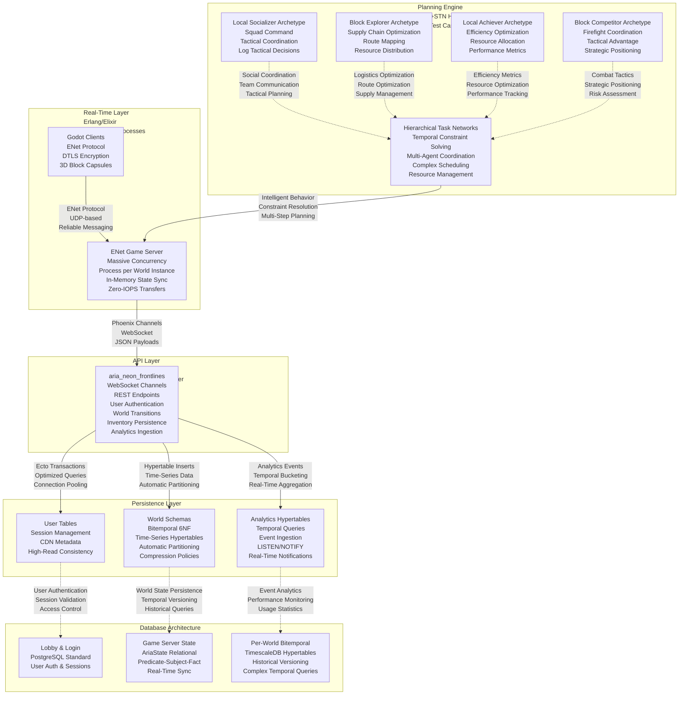

# V-Sekai: Neon Frontlines

**About This Game**

Enter a cyberpunk metropolis where every shadow hides opportunity and every neon glow masks danger. V-Sekai: Neon Frontlines is a revolutionary massively multiplayer platform that combines cutting-edge AI planning systems with immersive 3D environments.

In this neon-drenched city block, four distinct operative archetypes clash in tactical logistics warfare:

- **Local Socializer**: Command squads and coordinate tactical operations
- **Block Explorer**: Master supply chains and optimize resource distribution
- **Local Achiever**: Maximize efficiency through intelligent resource allocation
- **Block Competitor**: Outmaneuver rivals in high-stakes firefight coordination

## Key Features

🎯 **Intelligent AI Companions**

- HTN+STN hybrid planning system for realistic agent behavior
- Temporal constraint solving for complex multi-step operations
- 382 comprehensive test cases ensuring reliable AI interactions

⚡ **Massive Scalability**

- Erlang/Elixir game server handling thousands of concurrent players
- PostgreSQL with TimescaleDB for lightning-fast time-series data
- Horizontal scaling that grows with your community

🌆 **Immersive Cyberpunk World**

- Single city block environment with rich tactical possibilities
- Neon aesthetics and atmospheric lighting
- Dynamic weather and environmental effects

🎮 **Four Play Styles**

- **Socializers**: Build alliances and coordinate team efforts
- **Explorers**: Discover optimal routes and hidden opportunities
- **Achievers**: Optimize systems and maximize efficiency
- **Competitors**: Engage in tactical combat and strategic dominance

## System Requirements

**Minimum:**

- OS: Windows 10, macOS 10.15, Ubuntu 18.04
- Processor: Intel Core i5-6600K / AMD Ryzen 5 2600
- Memory: 8 GB RAM
- Graphics: NVIDIA GTX 1060 6GB / AMD RX 580 8GB
- Storage: 20 GB available space

**Recommended:**

- OS: Windows 11, macOS 12.0, Ubuntu 20.04
- Processor: Intel Core i7-8700K / AMD Ryzen 7 3700X
- Memory: 16 GB RAM
- Graphics: NVIDIA RTX 3070 / AMD RX 6700 XT
- Storage: 50 GB SSD space

## Steam Tags

Multiplayer, Strategy, Simulation, Cyberpunk, AI, Tactical, Real-time, Planning, Logistics, Competitive, Cooperative, Open World, Atmospheric, Sci-fi, Futuristic, Resource Management, Base Building, Combat, Team-based, Asynchronous Multiplayer

## Roadmap

**Phase 4**: Web-based text interface for easy access and testing
**Phase 5**: Enhanced 3D domain simulation with advanced archetypes
**Future Updates**: Cross-platform mobile support, VR integration, custom world creation

## Technical Architecture

---

_Built with Elixir, Phoenix, PostgreSQL, and Godot Engine_
