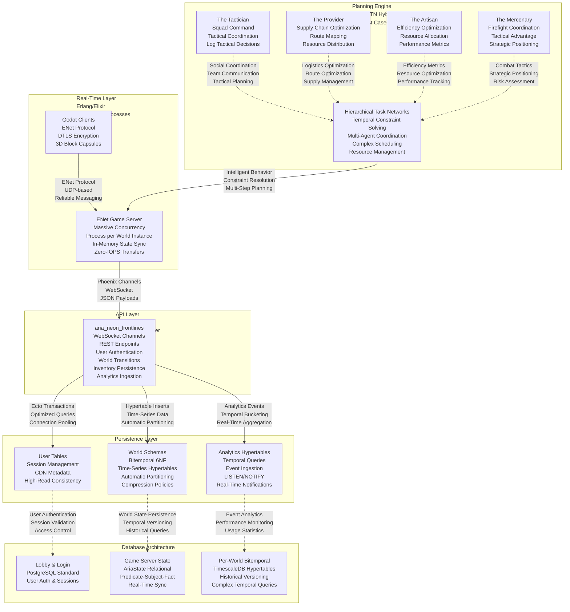

V-Sekai: Neon Frontlines

About This Game

V-Sekai: Neon Frontlines combines emergent AI planning systems with immersive 3D environments in a neon-drenched cyberpunk metropolis where every shadow hides opportunity and danger lurks in the glow.

Neon Frontlines features intelligent AI companions with goal-task temporal planning, massive scalability through Erlang/Elixir servers, an immersive cyberpunk world in a single city block, and four distinct play styles.

The Tactician: Lead your squad in coordinated, high-stakes operations. Master positioning and planning to execute flawless strategies, perfect for the natural raid leader.

The Gather: Become the engine of the district. Master supply chains, corner the market, and explore the block to fuel the economy through gathering and logistics.

The Crafter: Push the limits of efficiency. Optimize resource pipelines and craft superior gear, dedicating yourself to mastering the intricate systems of the metropolis.

The Combatant: Rise through the ranks in competitive combat. Outmaneuver rival squads in skill-based firefights where only the sharpest reflexes and tightest teamwork prevail.
Steam Tags

Multiplayer, Strategy, Cyberpunk, AI, Tactical, Planning, Logistics, Competitive, Cooperative, Sci-fi, Resource Management, Combat
System Requirements

Minimum:

    OS: Windows 10, Ubuntu 18.04

    Processor: Intel Core i5-6600K

    Memory: 8 GB RAM

    Graphics: NVIDIA GTX 1060 6GB

    Storage: 20 GB available space

Recommended:

    OS: Windows 11, Ubuntu 20.04

    Processor: Intel Core i7-8700K

    Memory: 16 GB RAM

    Graphics: NVIDIA RTX 3070

    Storage: 50 GB SSD space

Roadmap

Phase 4: Web-based text interface
Phase 5: Domain simulation
Phase 6: Enhanced 3D domain simulation
Technical Architecture

Built with Elixir, Phoenix, PostgreSQL, and Godot Engine
